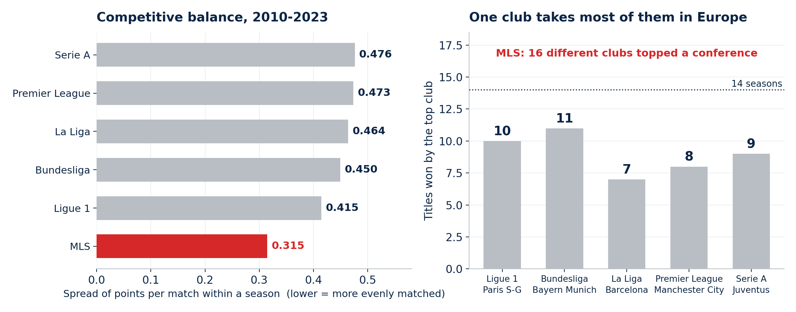
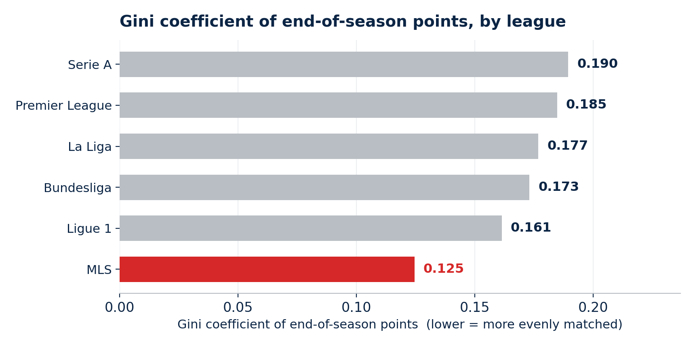
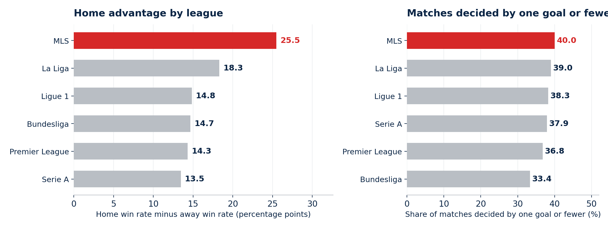
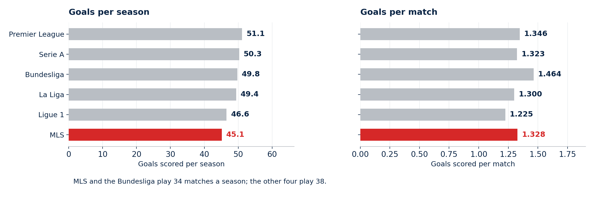
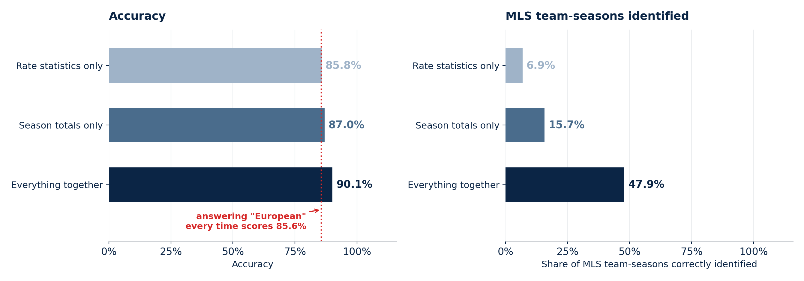
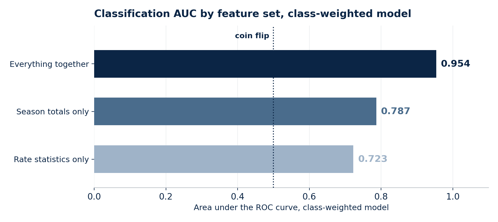

# MLS Has More Parity Than Europe's Big Five

> Fourteen seasons across six leagues, testing a claim you hear constantly and almost never see measured.

`Python` · `scikit-learn` · `statsmodels` · `SHAP`

## The question

"European soccer is more competitive than MLS." Most fans would nod at that. Very few would say what it means.

It turns out to mean two different things, and they don't point the same way:

- **Quality.** Are the best teams better? Almost certainly yes in Europe.
- **Balance.** Is the outcome of a season less predictable? Different question entirely.

Nobody separates them, so the argument never resolves. This is 1,680 team-seasons from the Bundesliga, La Liga, Ligue 1, the Premier League, Serie A and MLS, 2010 to 2024, asking the balance question on its own.

## Finding 1: MLS is the most evenly matched of the six

Balance means how tightly the table bunches up. If clubs finish on similar points, any of them could have won it. If one club runs away every year, the season was decided in August.

MLS and the Bundesliga play 34 matches while the others play 38, so this uses points **per match**.



MLS clubs finish within **0.315** points per match of each other. Ligue 1, the next tightest, sits at 0.415 — about a third wider. Serie A is the most spread out at 0.476.

The trophy cabinet says it more bluntly. Over these fourteen seasons, one club took most of the titles in every European league: **Bayern Munich won 11 of 14**, PSG 10, Juventus 9, Manchester City 8, Barcelona 7. Over the same stretch, **16 different MLS clubs** finished top of a conference.

### Checked a second way, and against the obvious objections

Spread of points is sensitive to schedule length, so it's worth a measure that isn't. The Gini coefficient — the statistic economists use for income inequality — is scale-free: multiply everyone's points by anything and it doesn't move.



Same ranking. MLS lowest at 0.125, and most equal of the six in **11 of the 14 seasons**. Two measures with different weaknesses agreeing isn't proof, but it would be a strange coincidence.

Anyone who knows MLS will raise two objections immediately:

**"You're pooling two conferences."** Computed *within* conference, the spread is 0.315 — identical.

**"MLS fields more clubs."** True, 16 to 29 against Europe's 18 to 20. But resampling Serie A and Ligue 1 down to MLS-sized tables leaves their spreads unchanged. And it would cut the other way anyway: MLS absorbed thirteen expansion sides over this period, and expansion teams are usually bad, which should have widened the spread rather than narrowed it.

None of this is accidental. A salary cap, a draft and no relegation are designed to produce exactly this. MLS trades the drama of a two-horse title race for most of the league starting the season with a real chance.

## Finding 2: home field is worth far more in MLS

So the leagues are balanced differently. Do they play differently?



MLS clubs win **25.5 percentage points** more often at home than away. The widest European gap is La Liga's 18.3; the other four sit between 13 and 15. MLS isn't at the edge of the European range, it's outside it.

Travel could be an obvious explanation. An MLS road trip can mean crossing a continent and three time zones, where a Premier League away day is a coach ride. This data can't confirm that. Distance and rest days aren't in the file, so travel stays a plausible hypothesis rather than a demonstrated cause.

Matches also stay close more often: 40.0% of MLS matches are decided by a single goal against 37.2% in the big five. That's the balance finding showing up again, match by match instead of in the final table.

### Two differences that look real and aren't

MLS clubs score about 45 goals a season against Europe's 49, and take 60 yellow cards against 77. Both gaps look meaningful.



But MLS plays 34 matches a season, and four of the five European leagues play 38 (the Bundesliga also plays 34). That's roughly 11% fewer chances to score or be booked before anything about the football enters into it. Per match:

- **Goals.** MLS scores **1.328 a match** against a European average of **1.332**. Essentially identical. MLS ranks third of the six, behind only the Bundesliga (1.464) and the Premier League (1.346), and ahead of Serie A, La Liga and Ligue 1.
- **Yellow cards.** MLS takes **1.76 a match**, close to the Premier League's 1.72 and Ligue 1's 1.78. The European average of 2.08 is pulled up by two outliers: La Liga at **2.65** and Serie A at **2.35**, which book far more than anyone else.

## Finding 3: league context is baked into the numbers

### Why classify leagues at all?

The first two findings compare leagues one metric at a time. This asks something different and more practical: **if you handed a model a team's season stats with the league name removed, could it tell you which league it came from?**

That matters for a specific reason. If a model can identify the league from on-pitch numbers alone, then those numbers carry the league with them. You cannot read an MLS team's or a player's stat line and compare it directly against a Premier League one, because a good chunk of what you're reading is the competition rather than the player. Anyone benchmarking a roster against European comparators, or evaluating a player arriving from another league, is making exactly that comparison.

So the question is worth asking. It's the *answer the original project gave* that turned out not to hold.

### The original answer, and why it doesn't work

The original trained a classifier, got **88–90% accuracy**, and read it as proof the leagues play differently. That number can't carry the claim.

Of the 1,510 usable team-seasons, **1,293 are European and only 217 are MLS.** Picture a model that never looks at the data and answers "European" every single time. It gets all 1,293 European seasons right and all 217 MLS ones wrong — **1,293 out of 1,510, or 85.6% accuracy, having learned nothing at all.**

That's the bar. Reporting 90% against it is a much smaller achievement than it sounds.



And the model scores well partly *because* it copies that strategy. It correctly identifies fewer than half the MLS seasons it was meant to find. On rate statistics alone, 6.9%.

### Asking it properly

Two changes:

1. **Class weighting.** Tell the model that missing an MLS season costs as much as missing a European one, so answering "European" everywhere stops being cheap.
2. **Score on AUC, not accuracy.** AUC measures how well the model *separates* the two groups — 0.5 is a coin flip, 1.0 is perfect — and it isn't affected by one group being six times bigger.



After the improvement it reaches **AUC 0.954** and correctly identifies **92% of MLS team-seasons**. So the answer to the original question is yes, and firmly: the leagues are highly distinguishable from performance data alone. The original accuracy figure just wasn't the evidence for it, and would have looked nearly as good on a model that learned nothing.

It survives a harder test too. The same clubs recur across fourteen seasons, so random splits let a model recognise familiar teams rather than league patterns. Holding out whole clubs it scores **0.953**; whole seasons, **0.942**.

### What it does and doesn't license

**Does:** treat league as a real confounder when comparing teams or players across competitions. A stat line carries its league with it.

**Doesn't:** rank the leagues. A model distinguishing MLS from the Premier League shows they are *different*, not that one is better. Reading a quality ranking out of a classification score is exactly the step that produces the folk claim this project started with.

And part of the signal isn't football at all. Season totals alone reach AUC 0.787 while rate statistics reach 0.723, and the totals are the features sensitive to 34 versus 38 matches. Some of what looks like stylistic separation is schedule length in disguise.

## What I'd do next

1. **Add travel.** Distance between cities and days of rest would turn the home-advantage finding from a description into a testable explanation. The single biggest gap.
2. **Add money.** No wage bills or market values here, so nothing separates "plays differently" from "spends differently."
3. **Handle the schedule properly.** Per-match rates fix the crudest problem, but MLS's unbalanced conference schedule means opponent strength varies in ways division doesn't capture.
4. **Include the playoffs.** Balance is measured on regular-season tables, and MLS decides its championship by playoff — a further source of uncertainty this ignores.
5. **More leagues.** Six is enough to compare MLS against the big five, not enough to place it among leagues generally. Liga MX and the Eredivisie would be the interesting additions.

<details>
<summary><b>Data and method</b></summary>

Fixtures, squad standard stats and league standings merged to team-season level across the six leagues, 2010–2024. 1,680 team-seasons, 1,510 complete across all 24 performance columns.

Balance is the within-season standard deviation of points per match, averaged over seasons, cross-checked against the Gini coefficient of raw points, and computed within MLS conference and against European tables resampled to MLS club counts. Title concentration counts first-place finishes; MLS awards two conference titles a season, so it has twice the winner slots and is reported as "how many different clubs" rather than compared slot for slot.

Classification uses logistic regression on standardized features with 5-fold stratified cross-validation, reported with `class_weight="balanced"`, and repeated under `GroupKFold` on club and on season. The notebook also carries the original RFECV feature selection, a statsmodels summary, a pruned decision tree and SHAP interpretation.

Those coefficients need care. The feature set contains near-duplicates (`goals`, `goals_excluding_pk`, `goals_and_assists` and their per-90 versions), so individual coefficients trade off against one another and aren't stable effect estimates. That's why the README leans on schedule-corrected comparisons and the home-advantage test rather than coefficient rankings.

**Limits.** No financial data, so nothing separates playing differently from spending differently. Balance uses regular-season standings only. Six leagues. Travel is untested.

</details>

## Where this started

A solo mini-project comparing competitiveness between Europe's big five and MLS. The data assembly is what made everything above possible — fourteen seasons of standings, squad stats and fixtures across six leagues, merged into one clean team-season table. It opened with an assumption stated plainly on slide two: *"European Leagues are inherently more competitive than MLS."* The target variable was coded from it, MLS = 0. Going back and testing that assumption instead of building on it is what produced all of this. The original deck had already noticed that "MLS teams show more parity and variability" — buried under a framing that assumed the opposite. It's in `original-project/`.

## Running it

```bash
pip install -r requirements.txt
python3 make_balance_figure.py
python3 make_model_figures.py
```
